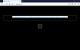

# Diceware Web

Diceware Web is a static, JavaScript site with no external resources that
generates 8-word Diceware passwords.

# Usage

    npm run start

OR

    docker run ckxng/diceware-web:latest

# Live Demo

https://diceware.azurewebsites.net/

Please allow a minute for the container to boot.  If the container does not come up in a few minutes, try again the next day.

# Screenshot

# Author

[Cameron King](http://cameronking.me)

# License

This software is released under the ISC license.

See `LICENSE` file for details.
